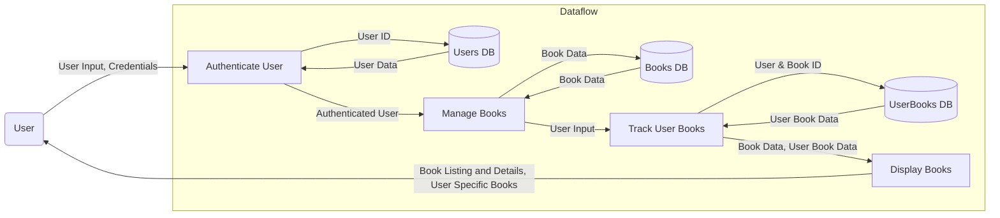

```mermaid
graph LR
    User(User)
    subgraph Dataflow
        p1[Authenticate User]
        ds1[(Users DB)]
        p2[Manage Books]
        ds2[(Books DB)]
        p3[Track User Books]
        ds3[(UserBooks DB)]
        p4[Display Books]
    end
    User -->|User Input, Credentials| p1
    p1 -->|User ID| ds1
    ds1 -->|User Data| p1
    p1 -->|Authenticated User| p2
    p2 -->|Book Data| ds2
    ds2 -->|Book Data| p2
    p2 -->|User Input| p3
    p3 -->|User & Book ID| ds3
    ds3 -->|User Book Data| p3
    p3 -->|Book Data, User Book Data| p4
    p4 -->|Book Listing and Details, User Specific Books| User
```
