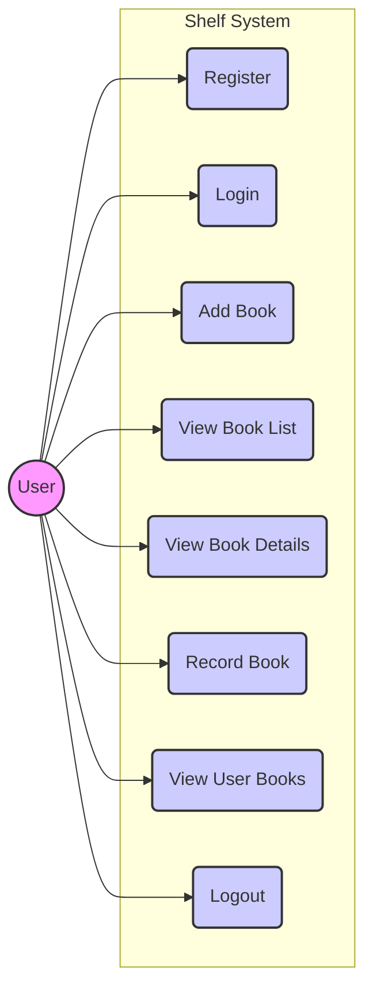

```mermaid
graph LR
    User((User))
    subgraph "Shelf System"
      uc1(Register)
      uc2(Login)
      uc3(Add Book)
      uc4(View Book List)
      uc5(View Book Details)
      uc6(Record Book)
      uc7(View User Books)
      uc8(Logout)
    end
    User --> uc1
    User --> uc2
    User --> uc3
    User --> uc4
    User --> uc5
    User --> uc6
    User --> uc7
    User --> uc8
    style User fill:#f9f,stroke:#333,stroke-width:2px
    style uc1 fill:#ccf,stroke:#333,stroke-width:2px
    style uc2 fill:#ccf,stroke:#333,stroke-width:2px
    style uc3 fill:#ccf,stroke:#333,stroke-width:2px
    style uc4 fill:#ccf,stroke:#333,stroke-width:2px
     style uc5 fill:#ccf,stroke:#333,stroke-width:2px
    style uc6 fill:#ccf,stroke:#333,stroke-width:2px
    style uc7 fill:#ccf,stroke:#333,stroke-width:2px
    style uc8 fill:#ccf,stroke:#333,stroke-width:2px
```
