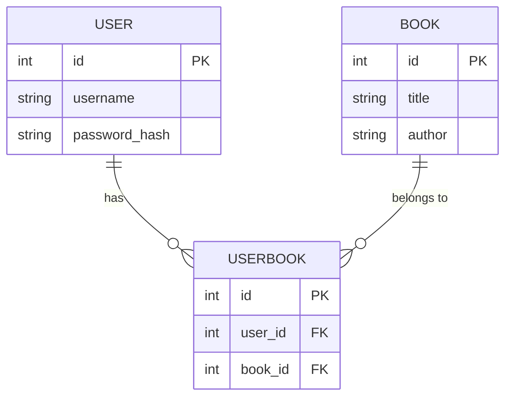

```mermaid
erDiagram
    USER {
        int id PK
        string username
        string password_hash
    }
    
    BOOK {
        int id PK
        string title
        string author
    }
    
    USERBOOK {
        int id PK
        int user_id FK
        int book_id FK
    }
    
    USER ||--o{ USERBOOK : "has"
    BOOK ||--o{ USERBOOK : "belongs to"
```
